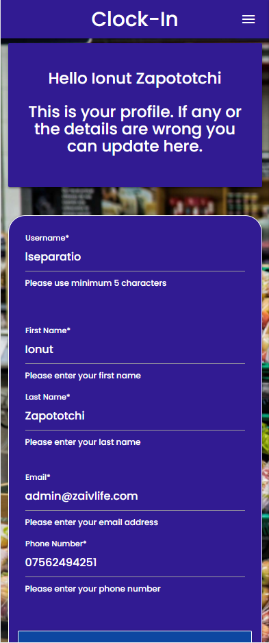
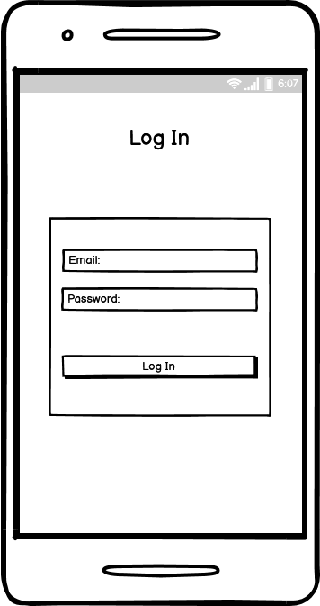
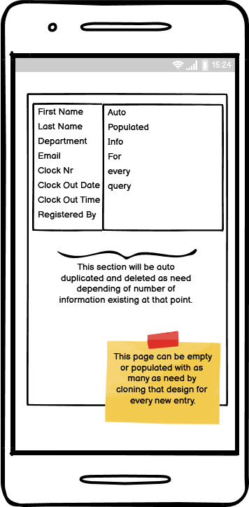
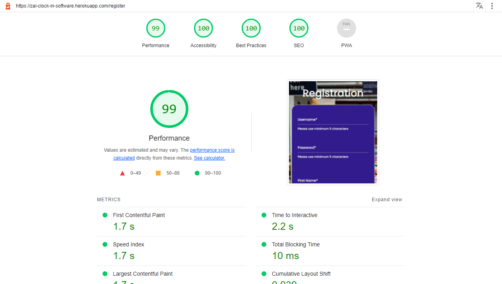

# Zai Clock in Software

Welcome, this project is 
this project is a clock in software for small business

See this project on live enviroment on GitHub Pages here: <https://zai-clock-in-software.herokuapp.com/>

### User Stories

As a employer:

- I want users to be able to easily navigate my website on any device.
- I want to bo able to add, edit employees.
- I want to be able to check presence.
- I want my website to be accessible to anyone even for screen readers.
- I want to be able to personalize my software

As a employee:

- I want to be able to clock in and out easy and fast.
- I want to know if my action was successfully.

## Features

Click To Expand Features

### Navigation

- Same navigation menu is used across all pages for consistency, but is hidden from user that is not authenticated because in index page is no need for navbar.

- Navigation was designed to be easy to use and to understand.

- Navigation was designed to work well on all devices.

### Index Screen

Index Screen was designed with employee in mind. Only required features are in this page. NFC is working only in Google Chrome For Android, and is activated if is possible.

- Index Screen Desktop

- Index Screen Tablet ( NFC INACTIVE )

- Index Screen Mobile ( NFC ACTIVE )
- NFC READY message appear on screen only if device is compatible, NFC is active and permissions given

### Registration Page

- Registration page is designed with employee, hr employees in mind

- Registration Page Mobile

### Verification Email

Once registration was successful email verification is required.

- Verification Email Desktop

- Verification Email Mobile Top Part

- Verification Email Mobile Bottom Part

### Verify Page

Once user click the email is redirected to verification page where have to input email address and secret code from email.

- Verification Page Desktop

- Verification Page Mobile

### Resend Verification

If user don't have verification code, can request to be resent to email address.

- Resend Verification Page Desktop

- Resend Verification Page Mobile

### Login Page

Once email is verified user is redirected to login. 

- Login Page Desktop

- Login Page Mobile

### Dashboard Page

Once email is verified user is redirected to login. 

- Dashboard Desktop

- Dashboard Mobile

### Settings Page

Settings page give the power to end user to customise the lock of his brand now software by changing brand name, navbar-footer color and text color and google font. More settings will be added latter. 

- Settings Page Desktop

- Settings Page Mobile

### Employer Profile Page( HR -Department)

In this page employer or hr department can see or update their details

- Employer Profile Page Desktop

- Employer Profile Page Mobile

### Working Now Page

In this page we can check who is working now, and clock in times.

- Working Now Page Desktop

- Working Now Page Mobile

### Home Now Page

In this page we can check who is not working now, and clock-out times.

- Home Now Page Desktop

- Home Now Page Mobile

### Add Employee Page

In this page we can add an employee. Clock nr is unique and because of that we generate this number automatically.

- Add Employee Page Desktop

- Add Employee Page Mobile

### Employees Page

In this page we can see all employees. And we have an link to edit page if is required.

- Employees Page Desktop

- Employees Page Mobile

### Edit Employees Page

In this page we can edit employee details, excepting Clock Nr.

- Edit Employees Page Desktop

- Edit Employees Page Mobile

### Delete Employees PopUp

In this page we can delete employee details, action is irreversible. We use clock in like a security.

- Delete Employees PopUp

- Delete Employees PopUp Mobile

## Wireframes, i used Balsamiq

Click to expand wireframes

### Index page

 - Desktop and tablet wirefame is shared because of minimalistic design

 - Mobile Wireframe

### Log In page

 - Desktop and tablet wirefame is shared because of minimalistic design

 - Mobile Wireframe

### Registration page

 - Desktop and tablet wirefame is shared because of minimalistic design

 - Mobile Wireframe

### Verify page

 - Desktop and tablet wirefame is shared because of minimalistic design

 - Mobile Wireframe

### Resend Verification page

 - Desktop and tablet wirefame is shared because of minimalistic design

 - Mobile Wireframe

### Dashboard page

 - Desktop and tablet wirefame is shared because of minimalistic design

 - Mobile Wireframe

### Settings page

 - Desktop and tablet wirefame is shared because of minimalistic design

 - Mobile Wireframe

### Profile page

 - Desktop and tablet wirefame is shared because of minimalistic design

 - Mobile Wireframe

### Add Admin page

 - Desktop and tablet wirefame is shared because of minimalistic design
 (Same as registration page)

 - Mobile Wireframe

### Working Now page

 - Desktop and tablet wirefame is shared because of minimalistic design

 - Mobile Wireframe

### Home Now page

 - Desktop and tablet wirefame is shared because of minimalistic design

 - Mobile Wireframe

### Add Employee page

 - Desktop and tablet wirefame is shared because of minimalistic design

 - Mobile Wireframe

### Employees page

 - Desktop and tablet wirefame is shared because of minimalistic design

 - Mobile Wireframe

### Edit Employee page

 - Desktop and tablet wirefame is shared because of minimalistic design

 - Mobile Wireframe

### Delete Employee page

 - Desktop and tablet wirefame is shared because of minimalistic design

 - Mobile Wireframe

### Nav Bar And Footer

 - Both are site-wide, desktop:

 - Mobile Wireframe

## Tools / Technologies

- Visual Studio Code
- HTML
- CSS
- JavaScript
- Python
- GIMP
- Microsoft Paint
- Materialize CSS 1.0.0
- Ubuntu 20.04 on WSL on Win 10 64bit
- Virtual Enviroments
- GIT, GitHub, Heroku, Heroku CLI
- MongoDB

## Database on MongoDB

For database MongoDB was the requirement.
I used <https://mongodb.com>

Click To See Database Collections

### Admin Collection

After registration of an admin details are stored in admin collection.  Please notice that email_is_verified is False and there is an verify_secret created. 

When user use correct secret code to verify the email address then email_is_verified is updated with true and secret code is deleted, for sequrity and to be able to reuse it if we have milions of registrations daily.

### Clock In Collection

When a employee clock-in using clock nr or clock-in card(ON NFC ONLY), details are stored on this collection. (Date, Time and Clock Nr). Because this is the most used feature, and time sensitive i decided to keep clock in and clock out in separate collections and to store the minimum required informations only here.

### Clock Out Collection

Same as clock in but when user clock out we store in another collection all the details: Both Clock In and Clock Out and after we delete the respective entry from Clock In. This is because the user can be or clock in or clock out never both.

### Clocks Collection

As we said earlier when user clock out we retrieve the informations from clock in before to be deleted, first name and last name from employee collection and clock out details and we build a document in this collection with all the details to be easy accesible for furter queries.

### Employee Collection

In this collection we keep all the details of a employee when is registered by admin. Clock nr is auto generated.

### Index Template Collection

In this, collection are stored template settings this in only collection that have to be created at script installation.

## Images

- Images was taken from: <https://www.pexels.com/>

## Testing

### Responsive Design Checker (Passing all checks)

<a href="https://responsivedesignchecker.com/checker.php?url=https%3A%2F%2Fzai-clock-in-software.herokuapp.com%2F&width=1400&height=700" rel="noopener" target="_blank">Click To See</a>

### LightHouse Tests

#### Mobile Tests

- Index Page 

- Login Page

- Register Page

- Dashboard Page

- Settings Page

- Profile Page

- Working Now Page

- Home Now Page

- Add Employee Page

- Presence Page

- Employees Page

#### Desktop Tests

- Index Page 

- Login Page

- Register Page

- Dashboard Page

- Settings Page

- Profile Page

- Working Now Page

- Home Now Page

- Add Employee Page

- Presence Page

- Employees Page

